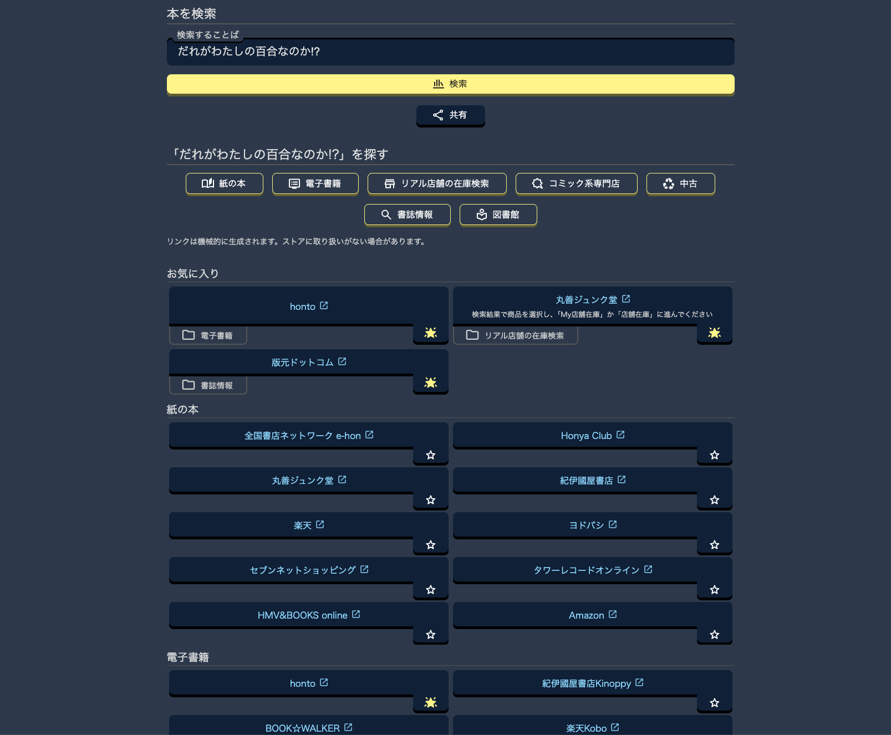

# honstore-et

[English](README.md)

[](https://github.com/Hyz-sui/honstore-et/blob/main/LICENSE)
[](https://bsky.app/profile/hyzsui.com)

<https://honst.hyzsui.com/>

オンライン書店、電子書籍ストア、実店舗から古本・図書館などさまざまな場所から本を一括で検索できるWebアプリケーションです。



## 機能

一つの検索ワードで、多数のオンライン書店、電子書籍ストア、リアル書店の在庫、中古書店、図書館、書誌情報などの横断的な検索用リンク集を生成します。

検索結果画面から直接リンク集を共有することもできます。

## 使い方

トップページにアクセスし、検索窓に探したい本のタイトルやキーワードを入力すると、各書店等の検索結果へのリンクが一覧で表示されます。目的のストアのリンクをクリックすることで、そのストアでの検索結果ページに直接ジャンプできます。

特定のストア等をお気に入りに追加すると、先頭にまとめて表示されます。

さらに、検索を行った状態のURLを他人に共有することで、相手が好きなストアで買ってもらうためのリンク集としても機能します。

## 開発

このプロジェクトはフロントエンドに[React](https://react.dev/)、バックエンドに[Hono](https://hono.dev/)を利用しており、[Cloudflare Workers](https://www.cloudflare.com/ja-jp/developer-platform/products/workers/) 上で動作します。

### 前提条件

- Node.js
- pnpm

### ローカルでの開発

依存関係をインストールし、ローカル開発サーバーを起動します。

1. 依存関係のインストール

    ```bash
    pnpm install
    ```

2. ローカル開発サーバーの起動

    ```bash
    pnpm run dev
    ```

## Credits & Thanks

- [encoding.js](https://github.com/polygonplanet/encoding.js): [MIT License](https://github.com/polygonplanet/encoding.js/blob/master/LICENSE)
- [Nano ID](https://github.com/ai/nanoid): [MIT License](https://github.com/ai/nanoid/blob/main/LICENSE)
- [Material Symbols](https://fonts.google.com/icons): [Apache License 2.0](https://www.apache.org/licenses/LICENSE-2.0)
- [vite-plugin-pwa](https://github.com/vite-pwa/vite-plugin-pwa): [MIT License](https://github.com/vite-pwa/vite-plugin-pwa/blob/main/LICENSE)
- [React](https://react.dev/): [MIT License](https://github.com/facebook/react/blob/main/LICENSE)
- [Vite](https://vite.dev/): [MIT License](https://github.com/vitejs/vite/blob/main/LICENSE)
- [Hono](https://hono.dev/): [MIT License](https://github.com/honojs/hono/blob/main/LICENSE)

## ライセンス

[AGPL-3.0](LICENSE)
